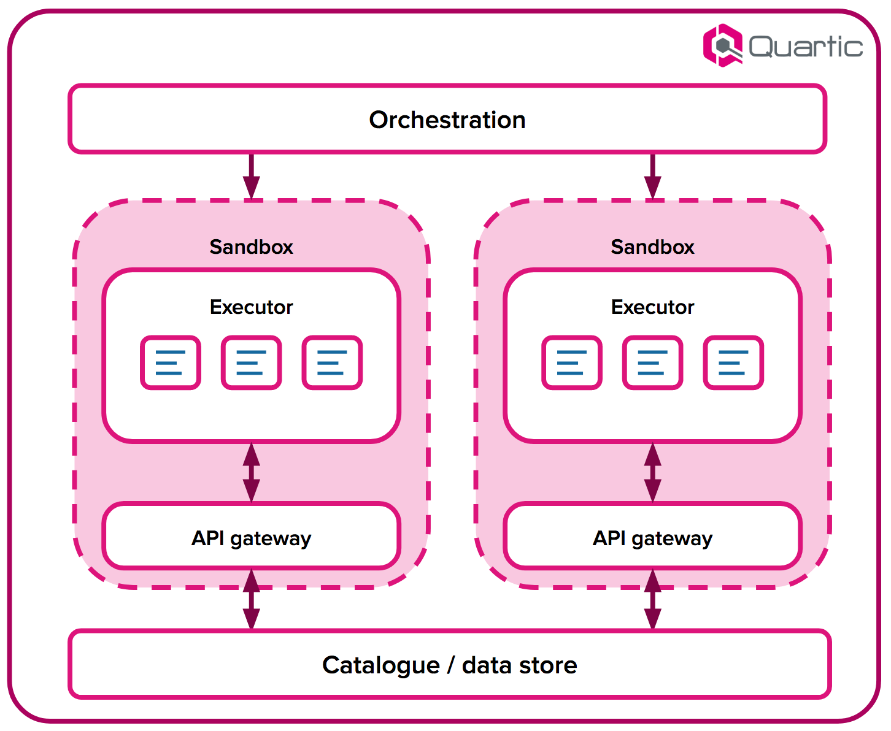

Pipeline steps are executed in shared-nothing sandbox containers.  Each sandbox communicates only via a dedicated API
gateway instance (see illustration below), and has no connectivity to the outside world.

This arrangement guarantees enforcement of namespace access controls, and prevents data leaks.  Code reproducibility is
maximised by eliminating uncontrolled external dependencies and providing a known execution environment.

{:width="50%"}

## Some more stuff.

Lorem ipsum dolor sit amet, consectetur adipiscing elit, sed do eiusmod tempor incididunt ut labore et dolore magna aliqua. Ut enim ad minim veniam, quis nostrud exercitation ullamco laboris nisi ut aliquip ex ea commodo consequat. Duis aute irure dolor in reprehenderit in voluptate velit esse cillum dolore eu fugiat nulla pariatur. Excepteur sint occaecat cupidatat non proident, sunt in culpa qui officia deserunt mollit anim id est laborum.

Lorem ipsum dolor sit amet, consectetur adipiscing elit, sed do eiusmod tempor incididunt ut labore et dolore magna aliqua. Ut enim ad minim veniam, quis nostrud exercitation ullamco laboris nisi ut aliquip ex ea commodo consequat. Duis aute irure dolor in reprehenderit in voluptate velit esse cillum dolore eu fugiat nulla pariatur. Excepteur sint occaecat cupidatat non proident, sunt in culpa qui officia deserunt mollit anim id est laborum.

```py
@step
def run(survey: "raw/survey") -> "clean/survey":
    survey_data = survey.data()

    for i in range(1, 4):
        input_col = "Measurement {}".format(i)
        output_col = "Measurement {} timestamp".format(i)
        survey_data[output_col] =
            survey_data[input_col].apply(datetime_to_unix)
        survey_data = survey_data.drop(input_col, axis=1)

    return writer("Cleaned survey").json({
        (d["Survey ID"]: d) for d in rows_as_dicts(survey_data)
    })
```